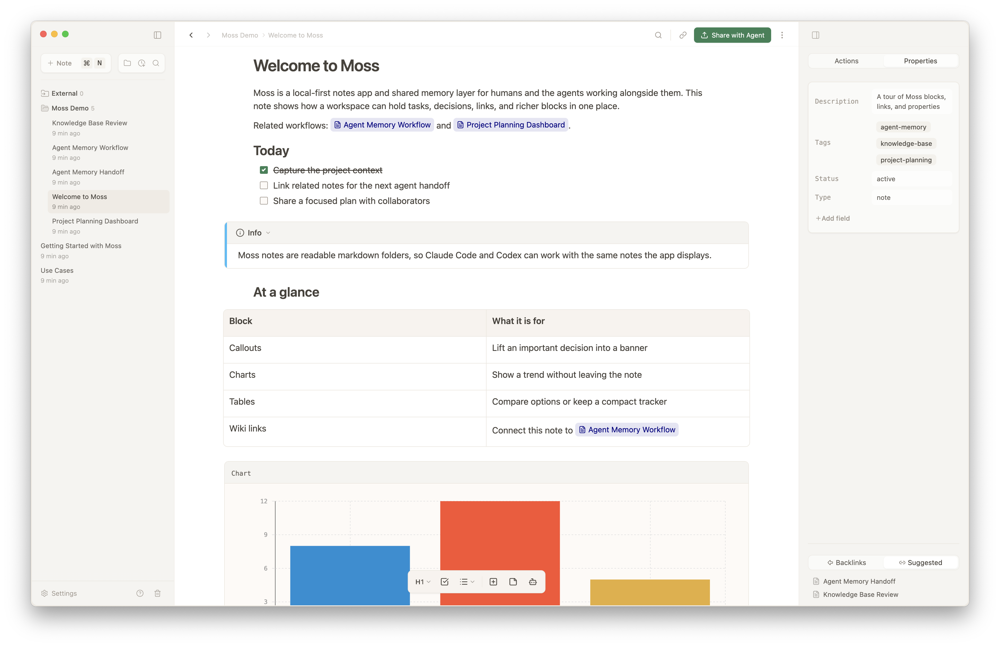

# Skills for working with [mossnotes.app](https://www.mossnotes.app/)

This repository provides skills for agentically working with [mossnotes.app](https://www.mossnotes.app/) notes, packaaged as Claude Code and Codex plugins.



The Moss app bundles these same skills for its in-app agent, and this repository makes them available as plugins to use with Claude Code and Codex directly. Use these plugins as is, or fork and customize them.

## What This Repo Is For

- Use this repository when you want Claude Code or Codex to read and write Moss markdown, folders, comments, wiki links, HTML mockups, and more.
- Use the installed app/exported skills at `~/Moss/.moss/skills/` when Claude Code or Codex is working against your Moss workspace and you want the skills to match your installed Moss app version.
- Fork this repository when you want to customize how Claude Code/Codex interacts with your Moss workspace.

### Important Note
If you customize these skills, do not change the Moss note syntax that's included in them. The Moss app expects specific syntax in markdown notes to work propertly and this currently can't be customized. You **can** customize how you want your agents to read/write this syntax (eg what workflow you want to use for resolving comments, styling of the HTML mockups embedded in your notes, etc.)

Forking this repository only affects the Claude Code and Codex plugins that are installed from it. It will not change the behavior of the in-app Moss agent.

## What Is Included

- `moss-notes`: how Moss note folders, markdown files, and supported note blocks work.
- `moss-frontmatter`: how Moss uses YAML frontmatter in note files.
- `moss-comments`: how to write and preserve Moss comment annotations.
- `moss-wiki-links`: how to link to notes and headings with Moss wiki links.
- `moss-mockup`: how to author interactive `moss-html` mockups.

Moss bb workflow references:

- `bb-workstream`: run a bb-managed Moss development effort from planning through cleanup.
- `bb-dashboard`: keep the workstream dashboard as the canonical manager review surface.
- `bb-planning`: turn prompts, notes, issues, PR feedback, and screenshots into scoped worker-ready plans.
- `bb-implementation`: assign scoped Moss implementation work to bb worker environments.
- `bb-verification`: gather UI, screenshot, Electron, browser, and user-flow evidence before review.
- `bb-qa`: run the QA merge gate, including focused checks and `moss verify`.
- `bb-review`: run the same-environment review gate for worker changes.
- `bb-summary`: produce final workstream, PR, and handoff summaries.
- `bb-cleanup`: safely archive or clean up completed, paused, or canceled bb workstream state.

bb workflow artifacts should live under `~/Moss/Agent Workspaces/bb Workspace/workstreams/<slug>/`, outside repo checkouts.

## Claude Code

Add this repository as a Claude Code plugin marketplace, then install the plugin:

```bash
/plugin marketplace add brsbl/moss-skills
/plugin install moss-skills@moss-skills
```

Installed skills are namespaced by the plugin name. For example:

```bash
/moss-skills:moss-notes
/moss-skills:moss-mockup
/moss-skills:bb-workstream
```

## Codex

Use the repository as a Codex plugin marketplace or local plugin source, then enable the `moss-skills` plugin. Codex will load the same `./skills/` tree used by Claude Code.

The Codex manifest lives at `.codex-plugin/plugin.json`, and `.agents/plugins/marketplace.json` points at the repository root plugin with `source.path` set to `./`.

## License

MIT. See `LICENSE`.
